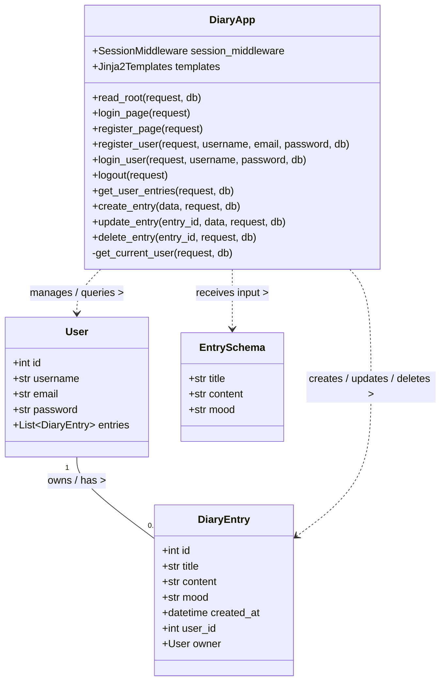

# Class Diagram - Diaryme Application

```mermaid
classDiagram
    direction TB

    class User {
        +int id
        +str username
        +str email
        +str password
        +List~DiaryEntry~ entries
    }

    class DiaryEntry {
        +int id
        +str title
        +str content
        +str mood
        +datetime created_at
        +int user_id
        +User owner
    }

    class EntrySchema {
        +str title
        +str content
        +str mood
    }

    class DiaryApp {
        +SessionMiddleware session_middleware
        +Jinja2Templates templates
        +read_root(request, db)
        +login_page(request)
        +register_page(request)
        +register_user(request, username, email, password, db)
        +login_user(request, username, password, db)
        +logout(request)
        +get_user_entries(request, db)
        +create_entry(data, request, db)
        +update_entry(entry_id, data, request, db)
        +delete_entry(entry_id, request, db)
        -get_current_user(request, db)
    }

    User "1" -- "0..*" DiaryEntry : owns / has >
    DiaryApp ..> User : manages / queries >
    DiaryApp ..> DiaryEntry : creates / updates / deletes >
    DiaryApp ..> EntrySchema : receives input >
```